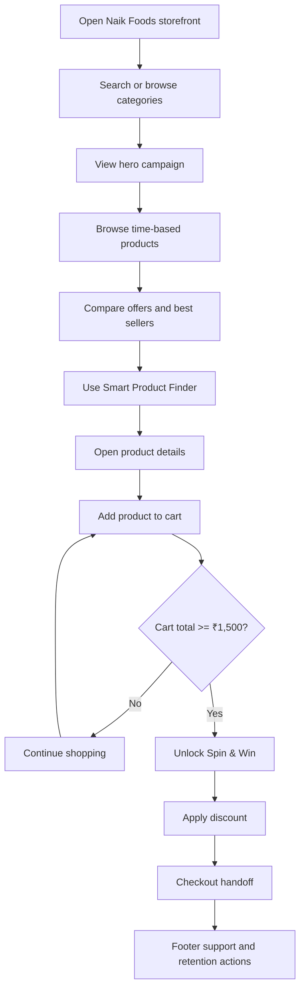

# Naik Foods Project Documentation

## 1. Executive Summary

Naik Foods is a responsive React storefront for authentic Maharashtrian snacks, pickles, masalas, gift boxes, and groceries. The frontend is implemented with Vite, React, JavaScript, Tailwind CSS support, custom CSS, and Lucide icons.

The project is designed as a single-page shopping experience with reusable product cards, shared cart state, a Smart Product Finder, product detail views, promotional sections, Spin & Win rewards, and a functional footer.

## 2. Stakeholder Perspectives

### Customer perspective

Customers can discover products, search and filter by category, browse campaigns, select time-based recommendations, inspect product details, save products, add products to a cart, unlock rewards, and proceed toward checkout.

### Developer perspective

Developers maintain a data-driven React application. Shared state is owned by `App` and passed to reusable components. Product arrays control product content, while CSS controls the responsive visual system.

### Manager perspective

Managers can understand the merchandising funnel, campaign placement, reward eligibility, content ownership, customer-retention opportunities, and future integration points for backend services.

## 3. Section Documentation

### 3.1 Fixed Header and Navigation


The header is shared across the storefront.

**Customer workflow**

- Search products by text or Enter key.
- Open All Categories by hover, focus, or click.
- Select Snacks, Pickles, Masalas, Groceries, Gift Boxes, and other categories.
- Open the Shop dropdown.
- Navigate to Home, Groceries, Offers, and other sections.
- Open Smart Product Finder.
- Open Spin & Win.
- Open the live cart drawer.

**Developer implementation**

The header is rendered in `src/App.jsx` and styled in `src/App.css`. Important state includes `selectedCategory`, `searchQuery`, `activeNav`, `finderOpen`, `spinOpen`, and `cartOpen`. Navigation uses smooth section scrolling instead of separate routes.

**Manager value**

The header is the main discovery and conversion surface. Search supports intent-based discovery, category menus reduce friction, the finder assists uncertain customers, and Spin & Win provides a promotion entry point.

### 3.2 Hero Carousel

The carousel uses the supplied hero-only assets:


**Customer workflow**

The carousel advances every 3.5 seconds, moves from right to left, supports arrows and dots, pauses on hover, supports pause/resume, responds to keyboard arrows, and supports mobile swipes.

**Developer implementation**

Slides are stored in the `slides` array. `activeSlide` controls the visible banner and the `slides-track` transform performs horizontal movement. Images use `object-fit: contain` to avoid cropping supplied artwork.

**Manager value**

The hero is the campaign layer for seasonal promotions, gifting, product discovery, and brand messaging.

### 3.3 Shop by Time of Day


**Customer workflow**

Customers select Morning, Afternoon, Evening, or Night. Product recommendations change according to the selected period. The initial period is selected from the customer’s local browser time:

- 6 AM to 12 PM: Morning
- 12 PM to 4 PM: Afternoon
- 4 PM to 8 PM: Evening
- 8 PM to 6 AM: Night

Each product supports wishlist, Add to Cart, and product details.

**Developer implementation**

Products are stored in `timeProducts`. `getTimeOfDay()` maps the current hour to a section. A one-minute interval keeps the period current.

**Manager value**

This section enables daypart merchandising. Product ordering and product content can be changed without modifying the section component.

### 3.4 Limited-Time Offers


**Customer workflow**

Customers see promotional prices, original prices, discount badges, a live countdown, product navigation, wishlist controls, and Add to Cart buttons.

**Developer implementation**

Offer content is stored in `offerProducts`. The countdown is updated by an interval. The reusable `ProductCard` component provides consistent product behavior.

**Manager value**

The section creates urgency and gives managers a focused area for campaign pricing and limited availability messaging.

### 3.5 Best Sellers


**Customer workflow**

Customers can browse popular products, identify Bestseller or Customer’s Choice items, open details, save products, add products to the cart, and navigate the product row.

**Developer implementation**

Best sellers are stored in `bestSellerProducts`. Product badges are controlled by data, and the section reuses the common product-card, cart, wishlist, and detail-view logic.

**Manager value**

Best Sellers communicates social proof and directs attention toward high-performing products.

### 3.6 Smart Product Finder


**Customer workflow**

The customer completes three stages:

1. Select a category: Snacks, Pickles, Masalas, Sweets, or Gifting.
2. Choose time, spice level, dietary preference, and shopper type.
3. Review personalized recommendations.

Recommendations support wishlist, Add to Cart, and full product details.

**Developer implementation**

`SmartProductFinder` is a modal component. It owns the active step, selected category, and preference state. Its recommendation cards use the same product-card contract as the storefront.

**Manager value**

The finder reduces choice overload and turns broad intent into a targeted product shortlist.

### 3.7 Product Details


**Customer workflow**

Clicking a product opens a detail view with a gallery, product information, weight selection, quantity controls, Add to Cart, Buy Now, Overview, Ingredients, Nutritional Info, Reviews, and expandable FAQs.

**Developer implementation**

`ProductDetail` is a shared detail view. `selectedProduct` is owned by `App`, allowing products from every section and finder recommendation results to open the same experience.

**Manager value**

The detail view answers common purchase objections related to ingredients, nutrition, product quality, trust, delivery, reviews, and product suitability.

### 3.8 Cart and Spin & Win


**Customer workflow**

Customers can open the cart drawer, inspect items, change quantities, remove items, view subtotal and total, track progress toward ₹1,500, unlock Spin & Win, apply a discount, and proceed to checkout.

**Reward rules**

- New users receive an immediate free spin.
- Existing users must reach ₹1,500 cart value.
- The wheel awards a random 5%, 10%, 20%, or 30% discount.
- Applying a reward marks the user as existing in local storage.

**Developer implementation**

Cart state uses `cartItems`, `cartCount`, `cartValue`, and `discount`. `CartPanel` manages item-level cart interactions. `SpinWheelModal` receives cart value and user eligibility. The `naik-user-status` local-storage key persists the user status.

**Manager value**

The cart and reward loop encourages customers to increase basket value and complete checkout.

### 3.9 Footer

**Customer workflow**

The footer provides popular search chips, service promises, Shop links, Quick Links, Customer Care links, newsletter subscription, app download actions, social buttons, and payment-method display.

**Developer implementation**

Footer content is driven by `popularSearches`, `footerColumns`, and `footerBenefits`. Actions use shared notice and subscription handlers.

**Manager value**

The footer supports retention, trust, support discovery, newsletter capture, and payment confidence.

## 4. End-to-End Workflow



### Runtime flow

1. `main.jsx` mounts `App`.
2. `App` owns global UI state.
3. Data arrays populate the product sections.
4. Reusable cards call shared cart, wishlist, and detail handlers.
5. Finder, product details, cart, and Spin & Win render as state-driven overlays.
6. Navigation scrolls within the single-page storefront.

## 5. Technical Structure

```text
Naik-foods/
├── public/assets/       # Hero, product, and reference-derived image assets
├── src/
│   ├── App.jsx          # Application state, data, UI, and workflows
│   ├── App.css          # Component and responsive styles
│   ├── index.css        # Global styles and Tailwind import
│   └── main.jsx         # React entry point
├── index.html
├── package.json
└── vite.config.js
```

## 6. Development and Validation

Install dependencies and start the local development server:

```bash
npm install
npm run dev
```

The local Vite URL is normally `http://localhost:5173/`.

Validate production output with:

```bash
npm run build
npm run lint
npm run preview
```

The production bundle is generated in `dist/`.

## 7. Render Deployment

Configure the Render Static Site with:

- **Root Directory:** blank
- **Build Command:** `npm install && npm run build`
- **Publish Directory:** `dist`
- **Environment Variables:** none required by the current frontend

The deployed Render URL should be documented separately from the local development URL.

## 8. Asset Rules

- Hero slides use `hero-*-hero.jpeg`.
- Original supplied screenshots use `hero-*.jpeg`.
- Product artwork uses `product-*.jpeg`.
- Intro panels use `time-intro.jpeg` and `offers-intro.jpeg`.
- Runtime asset URLs begin with `/assets/`.

When replacing an image, keep the existing filename or update its reference in `src/App.jsx`.

## 9. State and Business Rules

- Product cards are shared across shopping sections.
- Cart value equals product price multiplied by quantity.
- Existing users unlock Spin & Win at ₹1,500.
- New-user status is persisted after a discount is applied.
- Applied discounts reduce the cart total.
- Time-of-day products follow the browser’s local hour.

## 10. Future Production Integrations

The current implementation is a frontend prototype using local React state. A production release can add:

- Authentication and account APIs.
- Product, pricing, and inventory APIs.
- Persistent cart and wishlist APIs.
- Payment gateway checkout.
- Review, media upload, and FAQ services.
- Analytics for search, product views, Add to Cart, Spin & Win, and checkout.

## Document Source

This document is generated from the project’s `README.md` and is intended to be a more formal handoff document for customers, developers, managers, and deployment stakeholders.
