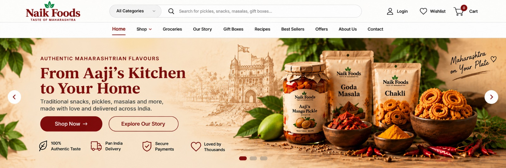
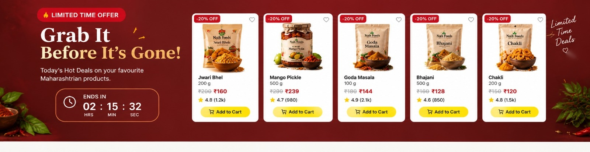
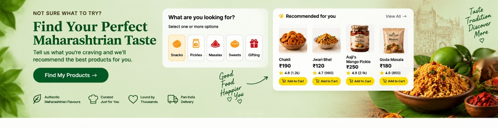
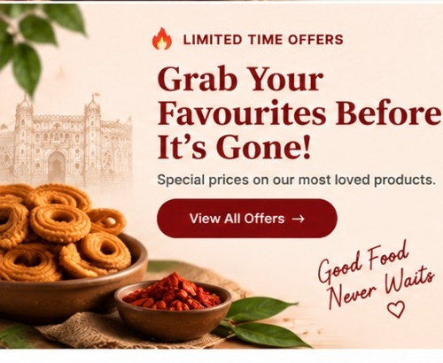
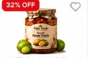
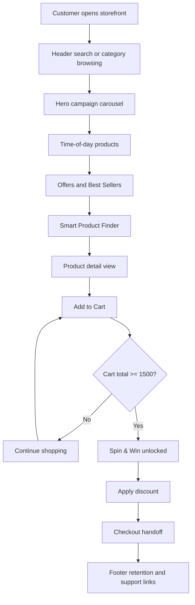

Naik Foods

Naik Foods is a responsive React storefront for authentic Maharashtrian snacks, pickles, masalas, gift boxes, and groceries. It is built with Vite, React, JavaScript, Tailwind CSS support, custom CSS, and Lucide icons.

The experience is designed around three perspectives:

- **Customer:** discover products, compare offers, personalize recommendations, add products to a cart, unlock Spin & Win, and inspect product information before buying.
- **Developer:** maintain reusable React state, data-driven product cards, responsive sections, image assets, and predictable Vite build commands.
- **Manager:** understand the conversion workflow, promotion rules, content ownership, and the business value of each section.

## Product Sections

### 1. Fixed Header and Navigation



#### Customer view

The customer can:

- Search for products using the search field or Enter key.
- Open **All Categories** by hover, focus, or click.
- Select categories such as Snacks, Pickles, Masalas, Groceries, and Gift Boxes.
- Open the Shop dropdown.
- Navigate to Home, Groceries, Offers, and other sections.
- Open the Smart Product Finder.
- Open Spin & Win.
- Open the live cart drawer.

#### Developer view

The header is rendered in `src/App.jsx`. Its important state includes:

- `selectedCategory` for the category selector.
- `searchQuery` for the search field.
- `activeNav` for navigation state.
- `finderOpen` for the Smart Product Finder modal.
- `spinOpen` for Spin & Win.
- `cartOpen` for the cart drawer.

Header styles are in `src/App.css`. Navigation handlers scroll to the matching page section instead of requiring separate routes.

#### Manager view

The header is the primary conversion surface. Search supports product discovery, category menus reduce browsing friction, the finder supports assisted selling, and Spin & Win creates a visible promotion entry point.

### 2. Hero Carousel

The four hero slides use the supplied hero-only assets:







#### Customer view

The customer sees one banner at a time. The carousel:

- Moves automatically every 3.5 seconds.
- Moves from right to left.
- Supports previous and next arrows.
- Supports pagination dots.
- Supports pause and resume.
- Pauses while hovered.
- Supports keyboard arrow navigation.
- Supports mobile swipe gestures.

#### Developer view

Slides are defined in the `slides` array in `src/App.jsx`. `activeSlide` controls the visible slide. The `slides-track` transform performs the horizontal movement. Images use the supplied aspect ratio and `object-fit: contain` so artwork is not cropped.

#### Manager view

The hero is the campaign layer. It can promote seasonal offers, gifting, discovery, or brand storytelling without changing the shared header or lower shopping modules.

### 3. Shop by Time of Day


#### Customer view

Customers can select Morning, Afternoon, Evening, or Night. The product list changes to match the selected time. The active time is also selected automatically from the local clock:

- 6 AM to 12 PM: Morning
- 12 PM to 4 PM: Afternoon
- 4 PM to 8 PM: Evening
- 8 PM to 6 AM: Night

Each product supports wishlist, Add to Cart, and click-to-open product details.

#### Developer view

Time-specific products are stored in `timeProducts` in `src/App.jsx`. `getTimeOfDay()` maps the current hour to a section. The app checks the time every minute and resets the product offset when the time period changes.

#### Manager view

This section enables time-based merchandising. Product recommendations can be changed by editing the `timeProducts` data without changing the component structure.

### 4. Limited-Time Offers



#### Customer view

Customers see promotional prices, old prices, discount badges, an offer countdown, product arrows, wishlist controls, and Add to Cart buttons. The countdown updates every second.

#### Developer view

Offer products are defined in `offerProducts`. The countdown is driven by an interval and displayed through the `countdown` state. The same `ProductCard` component is reused so offer behavior stays consistent with other product sections.

#### Manager view

Managers can use this area for urgency campaigns. Product prices, discount labels, and the offer duration are data-controlled in `src/App.jsx`.

### 5. Best Sellers


#### Customer view

The Best Sellers area highlights popular products with Bestseller or Customer’s Choice labels. Customers can:

- Open product details.
- Add products to the cart.
- Save products to the wishlist.
- Move through the product row with arrows.
- Use View All actions.

#### Developer view

Best sellers are defined in `bestSellerProducts`. Badge type is controlled by the `badge` property. The section reuses `ProductCard`, cart state, wishlist state, and product detail state.

#### Manager view

This section communicates social proof and merchandising priority. Product order and badge labels can be changed without restructuring the UI.

### 6. Smart Product Finder


The Smart Product Finder opens from the header.

#### Customer view

The customer completes three steps:

1. Select a category: Snacks, Pickles, Masalas, Sweets, or Gifting.
2. Select preferences: time, spice level, dietary preference, and shopper type.
3. Review personalized recommendations.

Recommendation cards support wishlist, Add to Cart, and full product details.

#### Developer view

`SmartProductFinder` is a modal component in `src/App.jsx`. It owns the current step, selected category, and preference values. Recommendations are data-driven and use the same product-card contract as the main storefront.

#### Manager view

The finder is an assisted-conversion workflow. It reduces choice overload and creates a path from vague intent, such as “I want snacks,” to a product shortlist.

### 7. Product Details



#### Customer view

Clicking any product opens a detailed product view with:

- Product gallery and thumbnails.
- Product name, price, rating, and reviews.
- Weight selection.
- Quantity controls.
- Add to Cart and Buy Now.
- Overview tab.
- Ingredients tab.
- Nutritional Info tab.
- Reviews tab.
- Expandable FAQs.
- Delivery and promotion information.

#### Developer view

`ProductDetail` is a shared modal-like detail page. `selectedProduct` is held by `App`, allowing cards from every section and from the finder to open the same detail workflow. Cart operations are passed into the detail component as callbacks.

#### Manager view

The detail view answers purchase objections before checkout: quality, ingredients, nutrition, trust, reviews, delivery, and product suitability.

### 8. Cart and Spin & Win


#### Customer view

The header Cart button opens a live cart drawer. Customers can:

- View each item and quantity.
- Increase or decrease quantities.
- Remove items.
- See subtotal and total.
- See progress toward ₹1,500.
- Open Spin & Win when eligible.
- Apply the discount to the cart total.
- Proceed to checkout.

Spin & Win rules:

- New users receive an immediate free spin.
- Existing users must reach ₹1,500 cart value.
- The wheel awards a random 5%, 10%, 20%, or 30% discount.
- Applying the reward marks the user as existing in local storage.

#### Developer view

The cart is managed in `App` using `cartItems`, `cartCount`, `cartValue`, and `discount`. `CartPanel` receives the item list and mutation callbacks. `SpinWheelModal` receives the current cart value and eligibility state. User status is persisted with the `naik-user-status` local-storage key.

#### Manager view

This is the main loyalty loop: product discovery leads to cart growth, cart growth unlocks a reward, and the reward encourages checkout completion.

### 9. Footer

#### Customer view

The footer provides:

- Popular search chips.
- Service promises.
- Shop links.
- Quick links.
- Customer care links.
- Email subscription.
- App download buttons.
- Social buttons.
- Payment method display.

#### Developer view

Footer content is defined with arrays such as `popularSearches`, `footerColumns`, and `footerBenefits`. Link buttons call shared notice handlers, while the subscription form validates that an email value is present before confirming subscription.

#### Manager view

The footer supports retention and trust. It gives customers additional discovery paths, explains service promises, captures newsletter interest, and reinforces payment confidence.

## Project Workflow



### Runtime workflow

1. `main.jsx` mounts `App` into the root element.
2. `App` owns shared state for navigation, carousel, cart, wishlist, finder, detail view, Spin & Win, and notices.
3. Product sections read from data arrays and render reusable cards.
4. Product card events call shared callbacks in `App`.
5. Detail, finder, cart, and wheel overlays receive state through props.
6. The browser remains on one Vite-powered page; navigation uses section scrolling and modal state.

## Project Structure

```text
Naik-foods/
├── public/assets/       # Hero, product, and reference-derived image assets
├── src/
│   ├── App.jsx          # Main UI, data, state, workflows, and reusable components
│   ├── App.css          # Component and responsive styling
│   ├── index.css        # Global reset and Tailwind import
│   └── main.jsx         # React entry point
├── index.html
├── package.json
└── vite.config.js
```

## Local Development

Requirements: Node.js and npm.

```bash
npm install
npm run dev
```

Open the local URL printed by Vite, normally `http://localhost:5173/`.

## Validation Commands

```bash
npm run build
npm run lint
npm run preview
```

`npm run build` creates the production output in `dist/`. `npm run lint` runs Oxlint.

## Render Deployment

Use these values for a Render Static Site:

- **Root Directory:** leave blank
- **Build Command:** `npm install && npm run build`
- **Publish Directory:** `dist`
- **Environment Variables:** none required for the current frontend

The repository is a Vite app, so Render must publish `dist`, not `src`.

## Asset Conventions

- Hero carousel assets use `hero-*-hero.jpeg`.
- Original supplied screenshots are retained as `hero-*.jpeg`.
- Product artwork uses `product-*.jpeg`.
- Intro panel assets use `time-intro.jpeg` and `offers-intro.jpeg`.
- Images are referenced from `/assets/...` at runtime.

When replacing an image, keep its filename or update the corresponding data object in `src/App.jsx`.

## State and Business Rules

- Product cards are reusable across all shopping sections.
- Cart total is calculated from product price multiplied by quantity.
- Cart progress unlocks Spin & Win at ₹1,500 for existing users.
- New-user status is stored in local storage after a discount is applied.
- Discounted cart total is calculated from the applied percentage.
- Time-of-day products update from the browser’s local hour.

## Future Integration Points

The current project is a frontend prototype with local state. A production system can replace the notice handlers and local state with:

- Authentication and account APIs.
- Product and inventory APIs.
- Persistent cart and wishlist APIs.
- Payment gateway checkout.
- Review, media upload, and FAQ services.
- Analytics events for search, product views, cart additions, Spin & Win, and checkout.
